# ChromaSDKPlugin - Unreal Engine 4 (UE4) Blueprint library to control lighting for (Razer Chroma)

**Table of Contents**

* [Related](#related)
* [Frameworks supported](#frameworks-supported)
* [Prerequisites](#prerequisites)
* [Engine Versions](#engine-versions)
* [Quick Start](#quick-start)
* [Key Bindings](#key-bindings)
* [Tutorials](#tutorials)
* [Usage](#usage)
* [Assets](#assets)
* [Blueprint objects](#blueprint-objects)
* [Blueprint functions](#blueprint-functions)
* [Examples](#examples)
* [Getting Started](#getting-started)

<a name="related"></a>
## Related

- [CChromaEditor](https://github.com/RazerOfficial/CChromaEditor) - C++ Native MFC Library for playing and editing Chroma animations

- [GameMakerChromaExtension](https://github.com/RazerOfficial/GameMakerChromaExtension) - GameMaker Extension to control lighting for Razer Chroma

- [UE4ChromaSDK](https://github.com/RazerOfficial/UE4ChromaSDK) - Unreal Engine 4 (UE4) Blueprint library to control lighting for Razer Chroma

- [UnityNativeChromaSDK](https://github.com/RazerOfficial/UnityNativeChromaSDK) - Unity native library for the ChromaSDK

- [UnityChromaSDK](https://github.com/RazerOfficial/UnityChromaSDK) - Unity C# library for the Chroma Rest API

<a name="frameworks-supported"></a>
## Frameworks supported
- Windows ChromaSDK (32-bit)
- Windows ChromaSDK (64-bit)

<a name="prerequisites"></a>
## Prerequisites

- Install [Visual Studio](https://www.visualstudio.com/)

- Install [Windows Software Development Kit (SDK) for Windows 8.1](https://developer.microsoft.com/en-us/windows/downloads/windows-8-1-sdk) - Needed to build plugin from source

- Install [Windows 10 SDK](https://developer.microsoft.com/en-us/windows/downloads/windows-10-sdk)

- Install `Templates->Other Languages->Visual C++->Visual C++ 2015 Tools for Windows Desktop` which can be installed through the `Visual Studio New Project Dialog`


<a name="engine-versions"></a>
## Engine Versions

[Releases](https://github.com/RazerOfficial/UE4ChromaSDK/releases/tag/1.0) have binary versions of the `Plugin` which can be added upon request.

<a name="quick-start"></a>
## Quick Start


**Set of Animations**

A set of animations refers to the following given an `AnimationName`. 

```
AnimationName_ChromaLink.chroma
AnimationName_Headset.chroma
AnimationName_Keyboard.chroma
AnimationName_Keypad.chroma
AnimationName_Mouse.chroma
AnimationName_Mousepad.chroma
```

**PlayAnimationComposite**

Play a set of *_Device.chroma Animations. With `loop` set to false, the animations will play once. With `loop` set to true, the animations will loop.

```c++
void UChromaSDKPluginBPLibrary::PlayAnimationComposite(const FString& animationName, bool loop);
```
<br>

**StopAnimationComposite**

Stop a set of *_Device.chroma Animations

```c++
void UChromaSDKPluginBPLibrary::StopAnimationComposite(const FString& animationName);
```
<br>


**PlayAnimation**

Play the *.chroma Animation. With `loop` set to false, the animation will play once. With `loop` set to true, the animation will loop.

```c++
void UChromaSDKPluginBPLibrary::PlayAnimation(const FString& animationName, bool loop);
```
<br>


**StopAnimation**

Stop the *.chroma Animation

```c++
void UChromaSDKPluginBPLibrary::StopAnimation(const FString& animationName);
```
<br>


**IsAnimationPlaying**

Is the *.chroma Animation playing?

```c++
bool UChromaSDKPluginBPLibrary::IsAnimationPlaying(const FString& animationName);
```
<br>


**PlayAnimations**

Play an array of *.chroma Animations

```c++
void UChromaSDKPluginBPLibrary::PlayAnimations(const TArray<FString>& animationNames, bool loop);
```
<br>


**StopAnimations**

Stop an array *.chroma Animations

```c++
void UChromaSDKPluginBPLibrary::StopAnimations(const TArray<FString>& animationNames);
```
<br>


**SetKeyColorName**

`SetKeyColorName` - Set the animation frame's key to the supplied color


**SetKeysColorName**

`SetKeysColorName` - Set the animation frame to the supplied color for a set of keys


**SetKeyColorAllFramesName**

`SetKeyColorAllFramesName` - Set the key to the supplied color for all animation frames


**SetKeysColorAllFramesName**

`SetKeysColorAllFramesName` - Set the keys to the supplied color for all animation frames


**CopyKeyColorName**

`CopyKeyColorName` - Copy color from a source animation to a target animation for a key


**CopyKeysColorName**

`CopyKeysColorName` - Copy color from a source animation to a target animation for a set of keys


**CopyKeysColorAllFramesName**

`CopyKeysColorAllFramesName` - Copy color from a source animation to a target animation for a set of keys for all frames


**GetFrameCountName**

`GetFrameCountName` - Get the .chroma animation frame count


<a name="key-bndings"></a>
## Key Bindings

Games often need to highlight hotkeys that are tied to game play. This can be for general `WASD` movement, interacting with the game, or display cooldowns.

Just displaying hotkeys by themselves is less visually interesting. Hotkeys can be shown on top of existing .chroma animations.

This allows environmental effects or other animations to be shown as the base layer with hotkeys on top of that.

In the below image, a loaded animation has the hotkeys added to each frame and then the animation plays.

1 When a .chroma animation is referenced by name, it's loaded from the game's `Content` folder into memory.

2 `Make Literal String` stores the .chroma animation name which is reused in multiple steps. In this case `Random_Keyboard` is stored.

2 `UnloadAnimationName` takes the animation name and unloads the Chroma color frames that were previously loaded so they can be modified.

3 `GetFrameCountName` takes the animaton name and returns the number of frames in the animation.

4 `For Loop` is used to iterate over all the frames in the animation.

5 `SetKeyColorName` takes the animation name, the color frame index, the key binding to update, and the color to show on the key. A constant color could be used, but to be more visually interesting, the example lerps between two colors using the frame index as the increment.

6 `PlayAnimation` takes the animation name to play the animation after the `For Loop` completes.

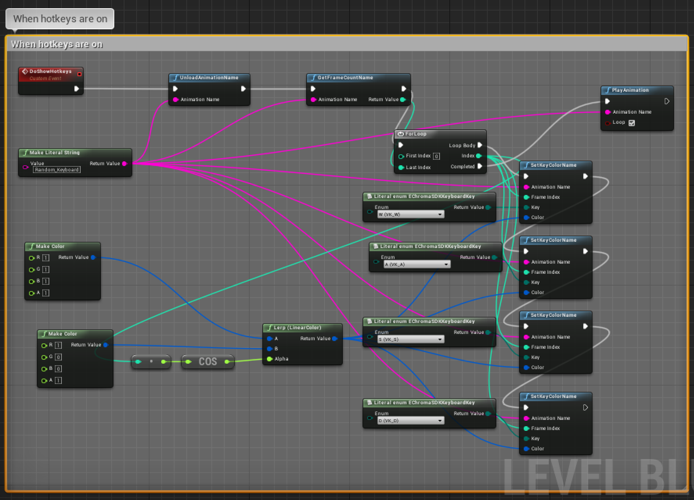

In the image below, an animation is reloaded from disk to hide the hotkeys.

1 `CloseAnimationName` takes the animation name and destroys the instance in memory.

2 `PlayAnimation` loads the animation name from disk in the original state without the hotkeys applied.

This process could be used to hide the hotkeys, or to reload the animation after the keybindings change to highlight new keys.

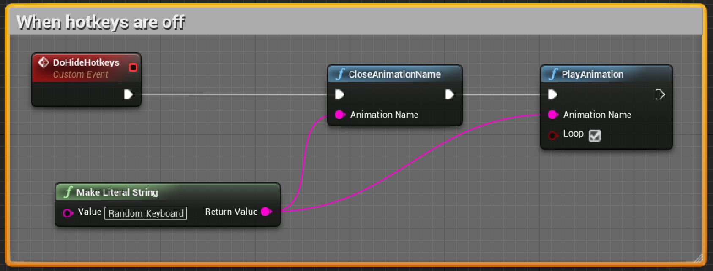

In the image below, a source animation color can be copied into a target animation. In this case a fire animation can play on selected hotkeys.

`CopyKeyColorName` takes the source animation name, target animation name, the frame index, and the key binding to update. The target animation will set the color from the source animation.

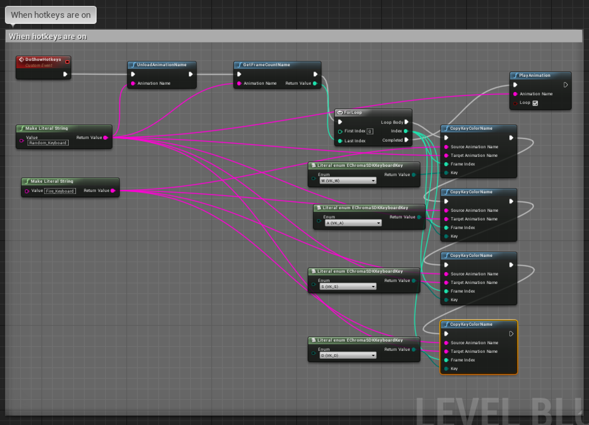

In the image below, an array of keys are set to the colors from a source animation. Another array of keys is set to a specific linear color. All the animation frames are copied or assigned for a set of keys by calling the `AllFrames` method.

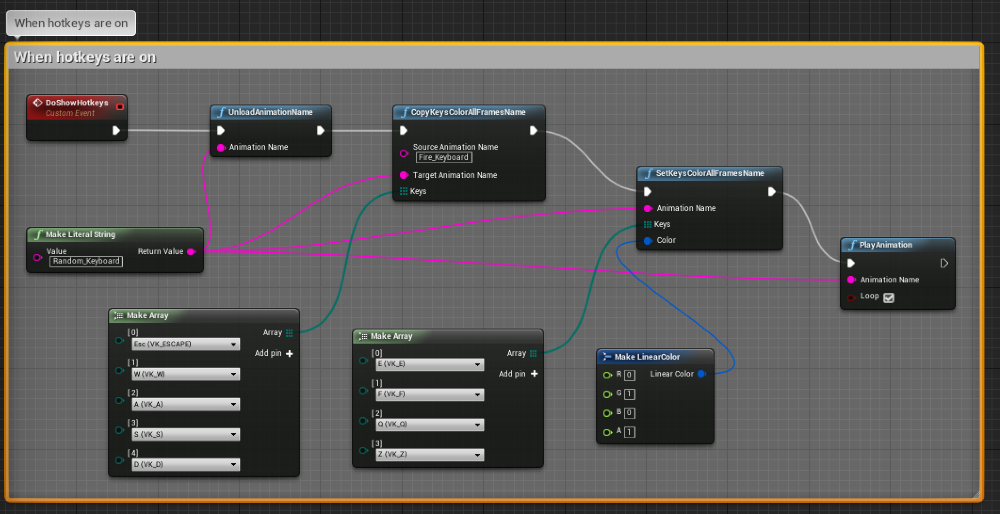

<a name="tutorials"></a>
## Tutorials

[Razer Chroma Playlist](https://www.youtube.com/playlist?list=PL4mjXeDqRBMRE19MjB8aiNPRnm_nYtct7)


**Import Runtime and Editor Modules**

<a target="_blank" href="https://www.youtube.com/watch?v=gcqFIOUq0bg"></a>


**Import Animation From Unity**

<a target="_blank" href="https://www.youtube.com/watch?v=4-NjkEHckkM"></a>


**Play Composite Animations From Content Folder**

<a target="_blank" href="https://www.youtube.com/watch?v=QFH_PZ50ROc"></a>


<a name="usage"></a>
## Usage

1 Copy `ChromaSDKPlugin` to the `ProjectFolder\Plugins\ChromaSDKPlugin` folder

2 Open the `Plugins Browser tab` using the `Edit->Plugins` menu item


3 Make sure the `ChromeSDKPlugin` is enabled

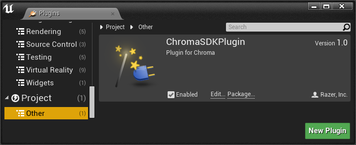

<a name="assets"></a>
## Assets

In the `Content Browser` under the `Add New->Miscellaneous` menu item is where animation assets can be created for `ChromaSDKPluginAnimation1DObject` and `ChromaSDKPluginAnimation2DObject`.

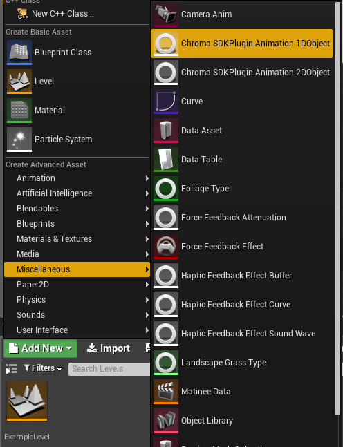

Hovering `ChromaSDK Animations` will show a `Play` or `Stop` thumbnail. Clicking the `Play` thumbnail will play the animation effect when in `play-mode` or `edit-mode`.

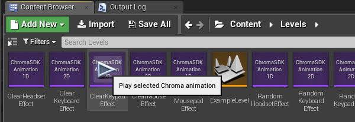

Right-click a `ChromaSDK Animation` and select `Edit` to open the custom `details view`.


The `details view` sets the device type and allows the color animation frames to be edited.
`1D` animations support `ChromaLink`, `Headset`, and `Mousepad` devices.
`2D` animations support `Keyboard`, `Keypad`, and `Mouse` devices.
The `device preview` shows a grid and clicking the elements will set the color from the color wheel.
The `Curve` adjusts the timings for each animation frame.

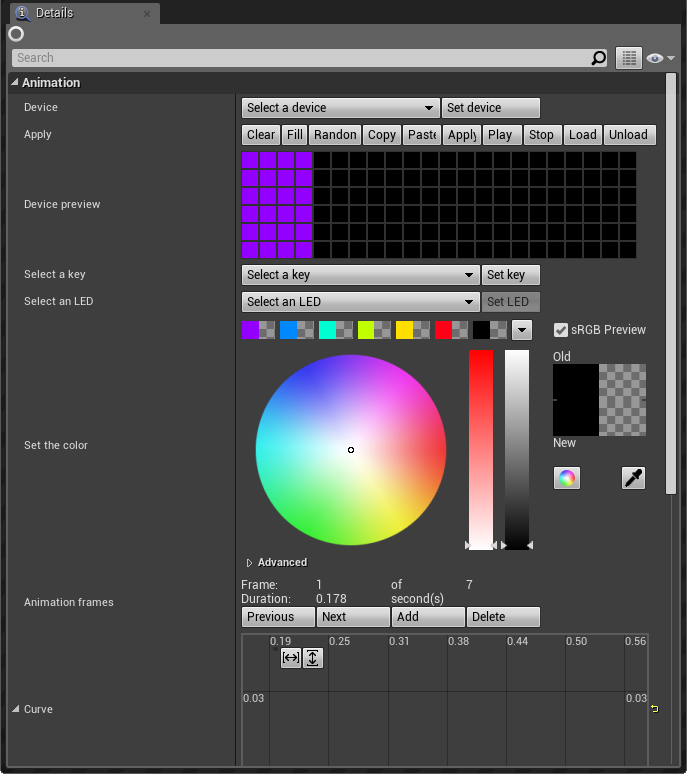

`ChromaSDK Animation` objects can be referenced from blueprints.
Create a variable of object type `ChromaSDKPluginAnimation1DObject` or `ChromaSDKPluginAnimation2DObject`.
Use the variable `SET` so the `animation asset` can be selected from the dropdown.

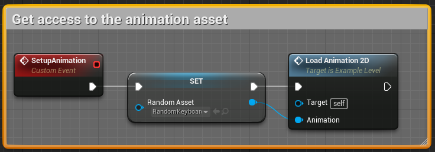

Use `Load` on the `animation` before it can be used.
Use `IsLoaded` to check if the `animation` has been loaded.

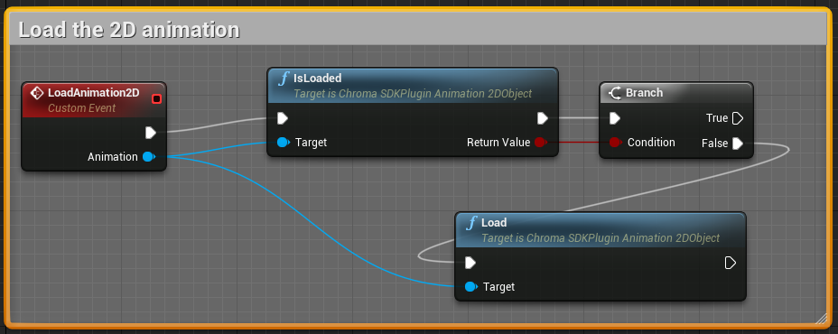

After the `ChromaSDK Animation` has been loaded and set in a variable, it can be played.

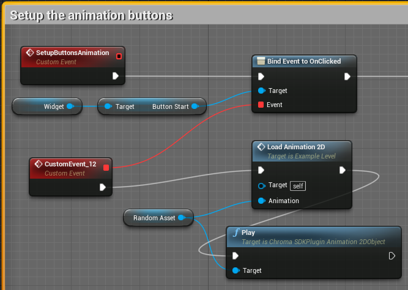

A playing `ChromaSDK Animation` can be stopped.

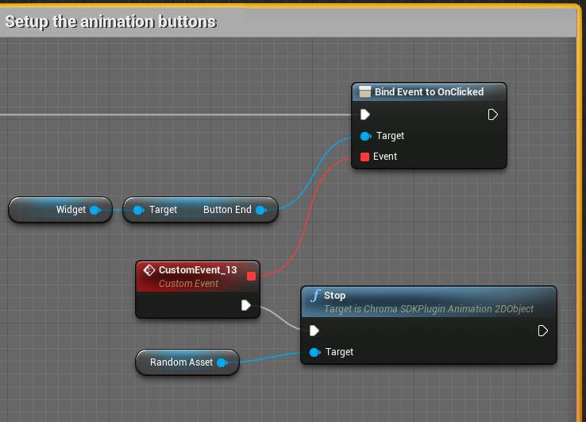

Use `Unload` to unload the animation.
`ChromaSDKPluginBPLibrary::UnInit` will automatically unload animations.


<a name="blueprint-objects"></a>
## Blueprint objects

### FChromaSDKEffectResult

`FChromaSDKEffectResult` holds a `ChromaSDK` result and an `effect identifier`.


```c++
struct FChromaSDKEffectResult
{
	UPROPERTY(BlueprintReadOnly)
	int Result;

	UPROPERTY(BlueprintReadOnly)
	FChromaSDKGuid EffectId;
}
```

### EChromaSDKDeviceEnum

`EChromaSDKDeviceEnum` is a list of all ChromaSDK devices.


```c++
enum class EChromaSDKDeviceEnum : uint8
{
	DE_ChromaLink           UMETA(DisplayName = "ChromaLink"),
	DE_Headset		UMETA(DisplayName = "Headset"),
	DE_Keyboard		UMETA(DisplayName = "Keyboard"),
	DE_Keypad		UMETA(DisplayName = "Keypad"),
	DE_Mouse		UMETA(DisplayName = "Mouse"),
	DE_Mousepad		UMETA(DisplayName = "Mousepad")
};
```

### EChromaSDKDevice1DEnum

`EChromaSDKDevice1DEnum` is a device that uses a one-dimensional array for custom effects.

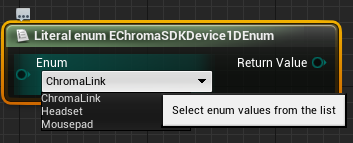

```c++
enum class EChromaSDKDevice1DEnum : uint8
{
	DE_ChromaLink	        UMETA(DisplayName = "ChromaLink"),
	DE_Headset		UMETA(DisplayName = "Headset"),
	DE_Mousepad		UMETA(DisplayName = "Mousepad")
};
```

### EChromaSDKDevice2DEnum

`EChromaSDKDevice2DEnum` is a device that uses a two-dimensional array for custom effects.

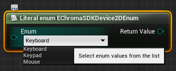

```c++
enum class EChromaSDKDevice2DEnum : uint8
{
	DE_Keyboard		UMETA(DisplayName = "Keyboard"),
	DE_Keypad		UMETA(DisplayName = "Keypad"),
	DE_Mouse		UMETA(DisplayName = "Mouse"),
};
```

### FChromaSDKColors

`FChromaSDKColors` holds an array of colors.


```c++
struct FChromaSDKColors
{
	UPROPERTY(BlueprintReadOnly)
	TArray<FLinearColor> Colors;
};
```

### EChromaSDKKeyboardKey

`EChromaSDKKeyboardKey` represents a key on the keyboard.

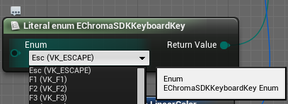

```c++
enum class EChromaSDKKeyboardKey : uint8
{
	KK_ESC                           UMETA(DisplayName = "Esc (VK_ESCAPE)"),
	KK_F1                            UMETA(DisplayName = "F1 (VK_F1)"),
	...
	KK_KOR_7                         UMETA(DisplayName = "(0xFF)"),
	KK_INVALID                       UMETA(DisplayName = "Invalid keys.")
};
```

### EChromaSDKMouseLed

`EChromaSDKMouseLed` represents an led on the mouse


```c++
enum class EChromaSDKMouseLed : uint8
{
	ML_SCROLLWHEEL		UMETA(DisplayName = "Scroll Wheel LED"),
	ML_LOGO			UMETA(DisplayName = "Logo LED"),
	...
	ML_RIGHT_SIDE6		UMETA(DisplayName = "Right LED 6"),
	ML_RIGHT_SIDE7		UMETA(DisplayName = "Right LED 7")
};
```

<a name="blueprint-functions"></a>
## Blueprint functions

### ChromaSDKPlugin BP Library

1. bool UChromaSDKPluginBPLibrary::IsPlatformWindows()
    * Returns true if the platform is windows. Although this call works on all platforms, all the remaining BP methods only work on the Windows platform
    
2. int UChromaSDKPluginBPLibrary::ChromaSDKInit()
    * Returns the result of calling ChromaSDK::Init(). Initializes the ChromaSDK.
    
3. int UChromaSDKPluginBPLibrary::ChromaSDKUnInit()
    * Returns the result of calling ChromaSDK::UnInit. Uninitializes the ChromaSDK.

4. FChromaSDKEffectResult UChromaSDKPluginBPLibrary::ChromaSDKCreateEffectNone(const EChromaSDKDeviceEnum&amp; device)
    * Returns the FChromaSDKEffectResult after creating a `CHROMA_NONE` effect given the device. This effect clears the lighting effect for a device.

5. FChromaSDKEffectResult UChromaSDKPluginBPLibrary::ChromaSDKCreateEffectStatic(const EChromaSDKDeviceEnum&amp; device, const FLinearColor&amp; color)
    * Returns the FChromaSDKEffectResult after creating a `CHROMA_STATIC` effect given the device and color. This effect sets the lighting effect to a static color for a device.

6. FChromaSDKEffectResult UChromaSDKPluginBPLibrary::ChromaSDKCreateEffectCustom1D(const EChromaSDKDevice1DEnum&amp; device, const TArray&lt;FLinearColor&gt;&amp; colors)
    * Returns the FChromaSDKEffectResult after creating a `CHROMA_CUSTOM` effect given the device and one-dimensional color array. This effect sets the lighting effect with an array of colors for a device.

7. FChromaSDKEffectResult UChromaSDKPluginBPLibrary::ChromaSDKCreateEffectCustom2D(const EChromaSDKDevice2DEnum&amp; device, const TArray&lt;FChromaSDKColors&gt;&amp; colors)
    * Returns the FChromaSDKEffectResult after creating a (`CHROMA_CUSTOM` or `CHROMA_CUSTOM2`) effect given the device and two-dimensional color array. This effect sets the lighting effect with an array of colors for a device.

8. int UChromaSDKPluginBPLibrary::ChromaSDKSetEffect(const FChromaSDKGuid&amp; effectId)
    * Returns the result of calling ChromaSDK::SetEffect given the effect identifier. Activates the given effect.
    
9. int UChromaSDKPluginBPLibrary::ChromaSDKDeleteEffect(const FChromaSDKGuid&amp; effectId)
    * Returns the result of calling ChromaSDK::DeleteEffect given the effect identifier. Deletes the given effect.

10. TArray&lt;FLinearColor&gt; CreateColors1D(const EChromaSDKDevice1DEnum&amp; device)
    * Returns a blank one-dimensional color array given the device.

11. TArray&lt;FChromaSDKColors&gt; CreateColors2D(const EChromaSDKDevice2DEnum&amp; device)
    * Returns a blank two-dimensional color array given the device.

12. TArray&lt;FLinearColor&gt; CreateRandomColors1D(const EChromaSDKDevice1DEnum&amp; device)
    * Returns a one-dimensional random color array given the device.

13. TArray&lt;FChromaSDKColors&gt; CreateRandomColors2D(const EChromaSDKDevice2DEnum&amp; device)
    * Returns a two-dimensional random color array given the device.

14. const TArray&lt;FChromaSDKColors&gt;&amp; SetKeyboardKeyColor(const EChromaSDKKeyboardKey&amp; key, const FLinearColor&amp; color, TArray&lt;FChromaSDKColors&gt;&amp; colors)
    * Returns a modified two-dimensional color array with the key color changed.

15. const TArray&lt;FChromaSDKColors&gt;&amp; SetMouseLedColor(const EChromaSDKMouseLed&amp; led, const FLinearColor&amp; color, TArray&lt;FChromaSDKColors&gt;&amp; colors)
    * Returns a modified two-dimensional color array with the led color changed.

<a name="examples"></a>
## Examples

### Example Level

The Example Level displays a UI `Blueprint Widget` with buttons that have `onclick events` that use the `ChromaSDKPlugin`.

1 Open the level in `Content/Levels/ExampleLevel`

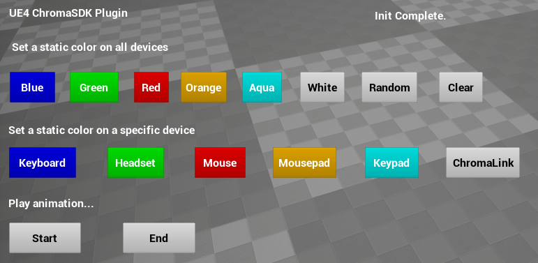

2 Open the UI `Blueprint Widget` in `Content/Blueprints/ExampleWidget_BP`


3 Open the `Level Blueprint` with the `Blueprints->Open Level Blueprint` menu item


4 The main features of the example level will be labelled with comment blocks

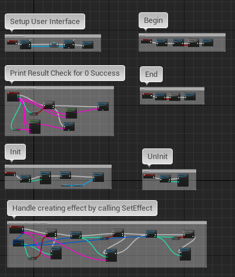

The example begins at `Event BeginPlay` which is executed on launch.
The `Setup UI` custom event loads the `Blueprint Widget`.
If the `Windows` platform is detected, the `ChromaSDKInit` custom event is called.


The `SetupUI` custom event loads the UI `Blueprint Widget` and saves a `widget` variable to be referenced by later UI controls.
The `Blueprint Widget` is added to the viewport and then the `SetupUIButtons` custom event is called.


The `SetupUIButtons` custom event uses the `widget` variable to access the named buttons to bind `onclicked` events.
When a button is clicked the `Event` delegate is invoked.
Since the `Event` delegate doesn't take parameters, an unnamed custom event is used to prepare the button parameters and invoke the `SetAllDeviceStaticColor` custom event.
`FLinearColor` is used to mimize the number of steps when passing colors to events and the SDK.
This same setup is used for all the static color buttons.

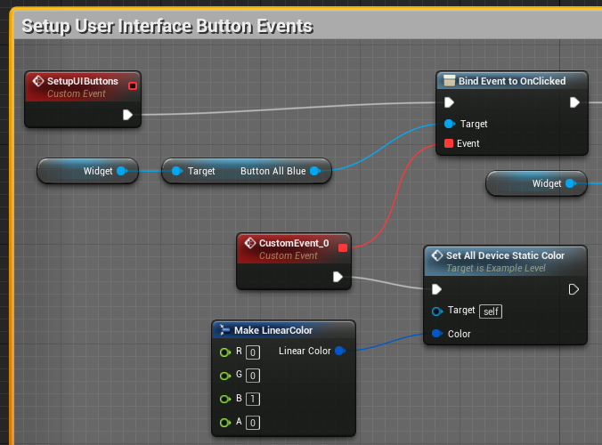

The `SetupUIButtons` custom event calls other custom events to setup the clear button, the random button, and the animation buttons.


The example ends at `Event EndPlay` which executes when the game exits or `ESC` is pressed in the editor.
If the `Windows` platform is detected, the `ChromaSDKUninit` custom event is called.


<a name="getting-started"></a>
## Getting Started

**Note: `ChromaSDKPlugin` calls should be made on the Windows platform.**

`DebugPrintResult` is an example custom event to check for result codes and print a message. The custom event takes parameters to include in the print message. A result code of zero is commonly used in the `API` to mean success. A success message is printed if detected. If an error message is printed if the result code is not zero.


### Init

**int UChromaSDKPluginBPLibrary::ChromaSDKInit()**

`Init` returns the result of calling ChromaSDK::Init(). Initializes the ChromaSDK. A result of zero indicates success. Upon success, effects can be created, set, and deleted.
    


### UnInit

**int UChromaSDKPluginBPLibrary::ChromaSDKUnInit()**

`UnInit` returns the result of calling ChromaSDK::UnInit. Uninitializes the ChromaSDK. A result of zero indicates success.

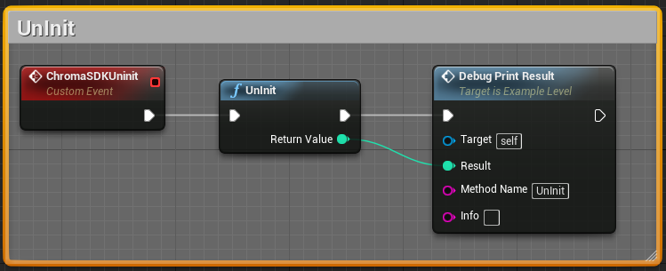

### CreateEffectNone

**FChromaSDKEffectResult UChromaSDKPluginBPLibrary::ChromaSDKCreateEffectNone(const EChromaSDKDeviceEnum&amp; device)**

`CreateEffectNone` returns the `FChromaSDKEffectResult` after creating a `CHROMA_NONE` effect given the device. This effect clears the lighting effect for a device. A result of zero indicates success.

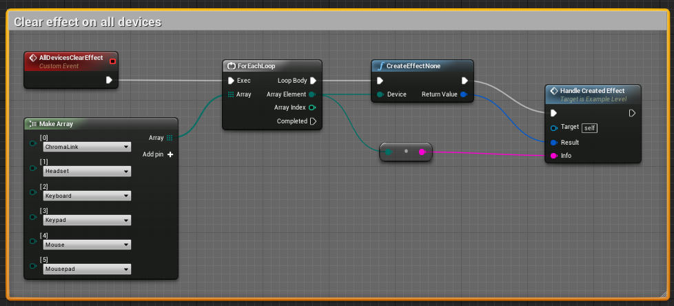

After effects are created, this example shows expanding the result to check the result for success. The `effect identifier` can be used to activate the effect with `SetEffect` or delete the effect with `DeleteEffect`.


After an effect has been set, check the result for success. Either success or failure, the `effect identifier` can be deleted with `DeleteEffect`.


After an effect has been deleted, check the result for success. After effects have been created they can be used and then deleted or kept around to be reused. Be sure to delete effect identifiers before exiting for proper cleanup.


### CreateEffectStatic

**FChromaSDKEffectResult UChromaSDKPluginBPLibrary::ChromaSDKCreateEffectStatic(const EChromaSDKDeviceEnum&amp; device, const FLinearColor&amp; color)**

`CreateEffectStatic` returns the `FChromaSDKEffectResult` after creating a `CHROMA_STATIC` effect given the device and color. This effect sets the lighting effect to a static color for a device.


### CreateEffectCustom1D

**FChromaSDKEffectResult UChromaSDKPluginBPLibrary::ChromaSDKCreateEffectCustom1D(const EChromaSDKDevice1DEnum&amp; device, const TArray&lt;FLinearColor&gt;&amp; colors)**

`CreateEffectCustom1D` returns the FChromaSDKEffectResult after creating a `CHROMA_CUSTOM` effect given the device and one-dimensional color array. This effect sets the lighting effect with an array of colors for a device.


### CreateEffectCustom2D

**FChromaSDKEffectResult UChromaSDKPluginBPLibrary::ChromaSDKCreateEffectCustom2D(const EChromaSDKDevice2DEnum&amp; device, const TArray&lt;FChromaSDKColors&gt;&amp; colors)**

`CreateEffectCustom2D` returns the FChromaSDKEffectResult after creating a (`CHROMA_CUSTOM` or `CHROMA_CUSTOM2`) effect given the device and two-dimensional color array. This effect sets the lighting effect with an array of colors for a device.


### SetEffect

**int UChromaSDKPluginBPLibrary::ChromaSDKSetEffect(const FChromaSDKGuid&amp; effectId)**

`SetEffect` returns the result of calling ChromaSDK::SetEffect given the effect identifier. Activates the given effect.


    
### DeleteEffect

**int UChromaSDKPluginBPLibrary::ChromaSDKDeleteEffect(const FChromaSDKGuid&amp; effectId)**

`DeleteEffect` returns the result of calling ChromaSDK::DeleteEffect given the effect identifier. Deletes the given effect.


### CreateColors1D

**TArray&lt;FLinearColor&gt; CreateColors1D(const EChromaSDKDevice1DEnum&amp; device)**

`CreateColors1D` returns a blank one-dimensional color array given the device.


### CreateColors2D

**TArray&lt;FChromaSDKColors&gt; CreateColors2D(const EChromaSDKDevice2DEnum&amp; device)**

`CreateColors2D` returns a blank two-dimensional color array given the device.


### CreateRandomColors1D

**TArray&lt;FLinearColor&gt; CreateRandomColors1D(const EChromaSDKDevice1DEnum&amp; device)**

`CreateRandomColors1D` returns a one-dimensional random color array given the device.


    
### CreateRandomColors2D

**TArray&lt;FChromaSDKColors&gt; CreateRandomColors2D(const EChromaSDKDevice2DEnum&amp; device)**

`CreateRandomColors2D` returns a two-dimensional random color array given the device.


### SetKeyboardKeyColor

**const TArray&lt;FChromaSDKColors&gt;&amp; SetKeyboardKeyColor(const EChromaSDKKeyboardKey&amp; key, const FLinearColor&amp; color, TArray&lt;FChromaSDKColors&gt;&amp; colors)**

`SetKeyboardKeyColor` returns a modified two-dimensional color array with the key color changed.

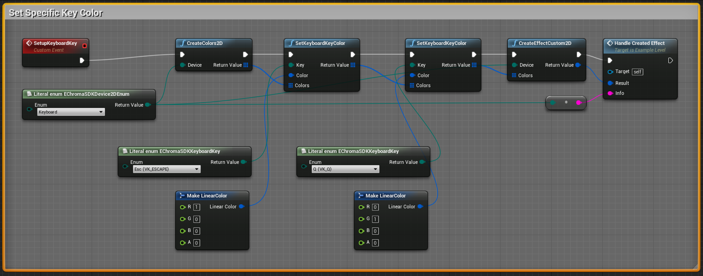

### SetMouseLedColor

**const TArray&lt;FChromaSDKColors&gt;&amp; SetMouseLedColor(const EChromaSDKMouseLed&amp; led, const FLinearColor&amp; color, TArray&lt;FChromaSDKColors&gt;&amp; colors)**

`MouseLedColor` returns a modified two-dimensional color array with the led color changed.

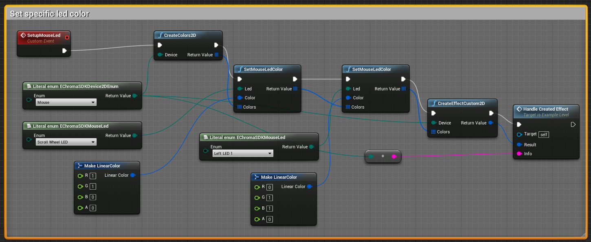
