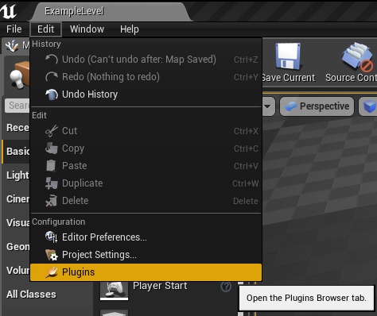
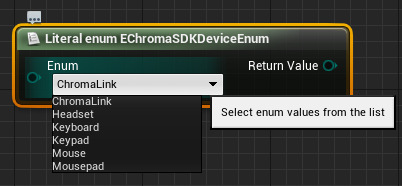
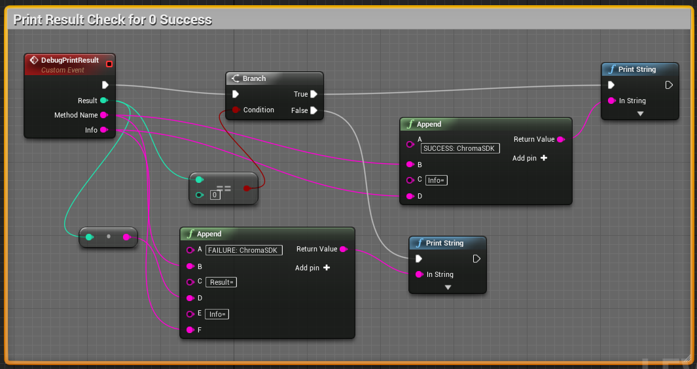
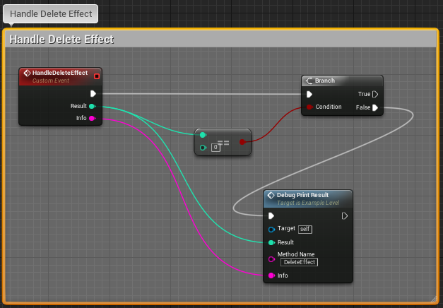

# ChromaSDKPlugin - Unreal Engine 4 (UE4) Blueprint library to control lighting for (Razer Chroma)

**Table of Contents**

* [Frameworks supported](#frameworks-supported)
* [Usage](#usage)
* [Blueprint objects](#blueprint-objects)
* [Blueprint functions](#blueprint-functions)
* [Examples](#examples)
* [Getting Started](#getting-started)

<a name="frameworks-supported"></a>
## Frameworks supported
- Windows ChromaSDK (32-bit)
- Windows ChromaSDK (64-bit)

<a name="usage"></a>
## Usage

1 Copy `ChromaSDKPlugin` to the `ProjectFolder\Plugins\ChromaSDKPlugin` folder

2 Open the `Plugins Browser tab` using the `Edit->Plugins` menu item



3 Make sure the `ChromeSDKPlugin` is enabled


<a name="blueprint-objects"></a>
## Blueprint objects

### FChromaSDKEffectResult

`FChromaSDKEffectResult` holds a `ChromaSDK` result and an `effect identifier`.


```c++
struct FChromaSDKEffectResult
{
	UPROPERTY(BlueprintReadOnly)
	int Result;

	UPROPERTY(BlueprintReadOnly)
	FChromaSDKGuid EffectId;
}
```

### EChromaSDKDeviceEnum

`EChromaSDKDeviceEnum` is a list of all ChromaSDK devices.



```c++
enum class EChromaSDKDeviceEnum : uint8
{
	DE_ChromaLink           UMETA(DisplayName = "ChromaLink"),
	DE_Headset		UMETA(DisplayName = "Headset"),
	DE_Keyboard		UMETA(DisplayName = "Keyboard"),
	DE_Keypad		UMETA(DisplayName = "Keypad"),
	DE_Mouse		UMETA(DisplayName = "Mouse"),
	DE_Mousepad		UMETA(DisplayName = "Mousepad")
};
```

### EChromaSDKDevice1DEnum

`EChromaSDKDevice1DEnum` is a device that uses a one-dimensional array for custom effects.


```c++
enum class EChromaSDKDevice1DEnum : uint8
{
	DE_ChromaLink	        UMETA(DisplayName = "ChromaLink"),
	DE_Headset		UMETA(DisplayName = "Headset"),
	DE_Mousepad		UMETA(DisplayName = "Mousepad")
};
```

### EChromaSDKDevice2DEnum

`EChromaSDKDevice2DEnum` is a device that uses a two-dimensional array for custom effects.


```c++
enum class EChromaSDKDevice2DEnum : uint8
{
	DE_Keyboard		UMETA(DisplayName = "Keyboard"),
	DE_Keypad		UMETA(DisplayName = "Keypad"),
	DE_Mouse		UMETA(DisplayName = "Mouse"),
};
```

### FChromaSDKColors

`FChromaSDKColors` holds an array of colors.


```c++
struct FChromaSDKColors
{
	UPROPERTY(BlueprintReadOnly)
	TArray<FLinearColor> Colors;
};
```

<a name="blueprint-functions"></a>
## Blueprint functions

### ChromaSDKPlugin BP Library

1. bool UChromaSDKPluginBPLibrary::IsPlatformWindows()
    * Returns true if the platform is windows. Although this call works on all platforms, all the remaining BP methods only work on the Windows platform
    
2. int UChromaSDKPluginBPLibrary::ChromaSDKInit()
    * Returns the result of calling ChromaSDK::Init(). Initializes the ChromaSDK.
    
3. int UChromaSDKPluginBPLibrary::ChromaSDKUnInit()
    * Returns the result of calling ChromaSDK::UnInit. Uninitializes the ChromaSDK.

4. FChromaSDKEffectResult UChromaSDKPluginBPLibrary::ChromaSDKCreateEffectNone(const EChromaSDKDeviceEnum&amp; device)
    * Returns the FChromaSDKEffectResult after creating a `CHROMA_NONE` effect given the device. This effect clears the lighting effect for a device.

5. FChromaSDKEffectResult UChromaSDKPluginBPLibrary::ChromaSDKCreateEffectStatic(const EChromaSDKDeviceEnum&amp; device, const FLinearColor&amp; color)
    * Returns the FChromaSDKEffectResult after creating a `CHROMA_STATIC` effect given the device and color. This effect sets the lighting effect to a static color for a device.

6. FChromaSDKEffectResult UChromaSDKPluginBPLibrary::ChromaSDKCreateEffectCustom1D(const EChromaSDKDevice1DEnum&amp; device, const FChromaSDKColors&amp; colors)
    * Returns the FChromaSDKEffectResult after creating a `CHROMA_CUSTOM` effect given the device and one-dimensional color array. This effect sets the lighting effect with an array of colors for a device.

7. FChromaSDKEffectResult UChromaSDKPluginBPLibrary::ChromaSDKCreateEffectCustom2D(const EChromaSDKDevice2DEnum&amp; device, const TArray&lt;FChromaSDKColors&gt;&amp; colors)
    * Returns the FChromaSDKEffectResult after creating a (`CHROMA_CUSTOM` or `CHROMA_CUSTOM2`) effect given the device and two-dimensional color array. This effect sets the lighting effect with an array of colors for a device.

8. int UChromaSDKPluginBPLibrary::ChromaSDKSetEffect(const FChromaSDKGuid&amp; effectId)
    * Returns the result of calling ChromaSDK::SetEffect given the effect identifier. Activates the given effect.
    
9. int UChromaSDKPluginBPLibrary::ChromaSDKDeleteEffect(const FChromaSDKGuid&amp; effectId)
    * Returns the result of calling ChromaSDK::DeleteEffect given the effect identifier. Deletes the given effect.

10. FChromaSDKColors CreateColors1D(const EChromaSDKDevice1DEnum&amp; device)
    * Returns a blank one-dimensional color array given the device.

11. TArray&lt;FChromaSDKColors&gt; CreateColors2D(const EChromaSDKDevice2DEnum&amp; device)
    * Returns a blank two-dimensional color array given the device.

12. FChromaSDKColors CreateRandomColors1D(const EChromaSDKDevice1DEnum&amp; device)
    * Returns a one-dimensional random color array given the device.

13. TArray&lt;FChromaSDKColors&gt; CreateRandomColors2D(const EChromaSDKDevice2DEnum&amp; device)
    * Returns a two-dimensional random color array given the device.

14. TArray&lt;FChromaSDKColors&gt; SetKeyboardKeyColor(const EChromaSDKKeyboardKey&amp; key, const FLinearColor&amp; color, TArray&lt;FChromaSDKColors&gt; colors)
    * Returns a modified two-dimensional color array with the key color changed.

<a name="examples"></a>
## Examples

### Example Level

The Example Level displays a UI `Blueprint Widget` with buttons that have `onclick events` that use the `ChromaSDKPlugin`.

1 Open the level in `Content/Levels/ExampleLevel`


2 Open the UI `Blueprint Widget` in `Content/Blueprints/ExampleWidget_BP`


3 Open the `Level Blueprint` with the `Blueprints->Open Level Blueprint` menu item


4 The main features of the example level will be labelled with comment blocks


The example begins at `Event BeginPlay` which is executed on launch.
The `Setup UI` custom event loads the `Blueprint Widget`.
If the `Windows` platform is detected, the `ChromaSDKInit` custom event is called.


The `SetupUI` custom event loads the UI `Blueprint Widget` and saves a `widget` variable to be referenced by later UI controls.
The `Blueprint Widget` is added to the viewport and then the `SetupUIButtons` custom event is called.


The `SetupUIButtons` custom event uses the `widget` variable to access the named buttons to bind `onclicked` events.
When a button is clicked the `Event` delegate is invoked.
Since the `Event` delegate doesn't take parameters, an unnamed custom event is used to prepare the button parameters and invoke the `SetAllDeviceStaticColor` custom event.
`FLinearColor` is used to mimize the number of steps when passing colors to events and the SDK.
This same setup is used for all the static color buttons.


The `SetupUIButtons` custom event calls other custom events to setup the clear button, the random button, and the animation buttons.


The example ends at `Event EndPlay` which executes when the game exits or `ESC` is pressed in the editor.
If the `Windows` platform is detected, the `ChromaSDKUninit` custom event is called.


<a name="getting-started"></a>
## Getting Started

**Note: `ChromaSDKPlugin` calls should be made on the Windows platform.**

`DebugPrintResult` is an example custom event to check for result codes and print a message. The custom event takes parameters to include in the print message. A result code of zero is commonly used in the `API` to mean success. A success message is printed if detected. If an error message is printed if the result code is not zero.



### Init

**int UChromaSDKPluginBPLibrary::ChromaSDKInit()**

`Init` returns the result of calling ChromaSDK::Init(). Initializes the ChromaSDK. A result of zero indicates success. Upon success, effects can be created, set, and deleted.
    


### UnInit

**int UChromaSDKPluginBPLibrary::ChromaSDKUnInit()**

`UnInit` returns the result of calling ChromaSDK::UnInit. Uninitializes the ChromaSDK. A result of zero indicates success.


### CreateEffectNone

**FChromaSDKEffectResult UChromaSDKPluginBPLibrary::ChromaSDKCreateEffectNone(const EChromaSDKDeviceEnum&amp; device)**

`CreateEffectNone` returns the `FChromaSDKEffectResult` after creating a `CHROMA_NONE` effect given the device. This effect clears the lighting effect for a device. A result of zero indicates success.


After effects are created, this example shows expanding the result to check the result for success. The `effect identifier` can be used to activate the effect with `SetEffect` or delete the effect with `DeleteEffect`.


After an effect has been set, check the result for success. Either success or failure, the `effect identifier` can be deleted with `DeleteEffect`.


After an effect has been deleted, check the result for success. After effects have been created they can be used and then deleted or kept around to be reused. Be sure to delete effect identifiers before exiting for proper cleanup.



### CreateEffectStatic

**FChromaSDKEffectResult UChromaSDKPluginBPLibrary::ChromaSDKCreateEffectStatic(const EChromaSDKDeviceEnum&amp; device, const FLinearColor&amp; color)**

`CreateEffectStatic` returns the `FChromaSDKEffectResult` after creating a `CHROMA_STATIC` effect given the device and color. This effect sets the lighting effect to a static color for a device.


### CreateEffectCustom1D

**FChromaSDKEffectResult UChromaSDKPluginBPLibrary::ChromaSDKCreateEffectCustom1D(const EChromaSDKDevice1DEnum&amp; device, const FChromaSDKColors&amp; colors)**

`CreateEffectCustom1D` returns the FChromaSDKEffectResult after creating a `CHROMA_CUSTOM` effect given the device and one-dimensional color array. This effect sets the lighting effect with an array of colors for a device.


### CreateEffectCustom2D

**FChromaSDKEffectResult UChromaSDKPluginBPLibrary::ChromaSDKCreateEffectCustom2D(const EChromaSDKDevice2DEnum&amp; device, const TArray&lt;FChromaSDKColors&gt;&amp; colors)**

`CreateEffectCustom2D` returns the FChromaSDKEffectResult after creating a (`CHROMA_CUSTOM` or `CHROMA_CUSTOM2`) effect given the device and two-dimensional color array. This effect sets the lighting effect with an array of colors for a device.


### SetEffect

**int UChromaSDKPluginBPLibrary::ChromaSDKSetEffect(const FChromaSDKGuid&amp; effectId)**

`SetEffect` returns the result of calling ChromaSDK::SetEffect given the effect identifier. Activates the given effect.


    
### DeleteEffect

**int UChromaSDKPluginBPLibrary::ChromaSDKDeleteEffect(const FChromaSDKGuid&amp; effectId)**

`DeleteEffect` returns the result of calling ChromaSDK::DeleteEffect given the effect identifier. Deletes the given effect.


### CreateColors1D

**FChromaSDKColors CreateColors1D(const EChromaSDKDevice1DEnum&amp; device)**

`CreateColors1D` returns a blank one-dimensional color array given the device.


### CreateColors2D

**TArray&lt;FChromaSDKColors&gt; CreateColors2D(const EChromaSDKDevice2DEnum&amp; device)**

`CreateColors2D` returns a blank two-dimensional color array given the device.


### CreateRandomColors1D

**FChromaSDKColors CreateRandomColors1D(const EChromaSDKDevice1DEnum&amp; device)**

`CreateRandomColors1D` returns a one-dimensional random color array given the device.


    
### CreateRandomColors2D

**TArray&lt;FChromaSDKColors&gt; CreateRandomColors2D(const EChromaSDKDevice2DEnum&amp; device)**

`CreateRandomColors2D` returns a two-dimensional random color array given the device.


### SetKeyboardKeyColor

**TArray&lt;FChromaSDKColors&gt; SetKeyboardKeyColor(const EChromaSDKKeyboardKey&amp; key, const FLinearColor&amp; color, TArray&lt;FChromaSDKColors&gt; colors)**

`SetKeyboardKeyColor` returns a modified two-dimensional color array with the key color changed.


